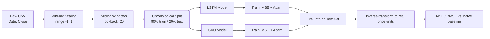
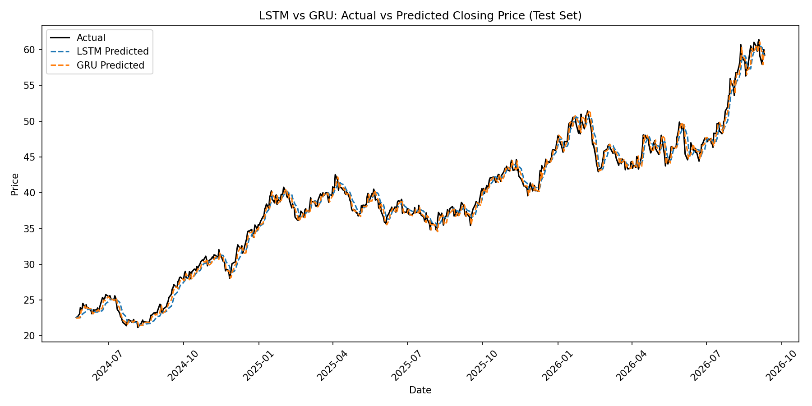
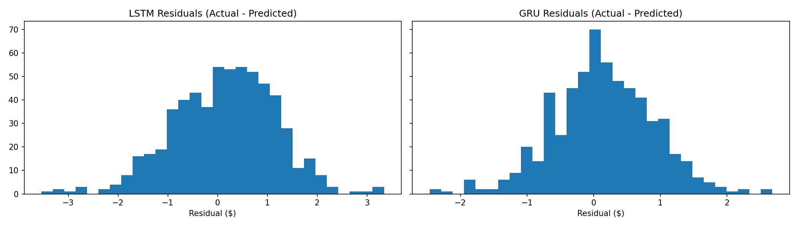

# 📈 Stock Price Prediction with PyTorch — LSTM vs. GRU

[](.github/workflows/tests.yml)
[](requirements.txt)
[](requirements.txt)
[](LICENSE)

A regression-based time series project that predicts next-day stock closing
prices using two recurrent neural network architectures — **LSTM** and
**GRU** — implemented from scratch in PyTorch, trained under identical
hyperparameters, and evaluated side by side against each other **and against
a naive baseline**.

Inspired by [Rodolfo Saldanha's "Stock Price Prediction with PyTorch"](https://medium.com/swlh/stock-price-prediction-with-pytorch-37f52ae84632).

---

## Table of Contents

- [Project Overview](#project-overview)
- [Repository Structure](#repository-structure)
- [A Note on the Data](#️-a-note-on-the-data)
- [Getting Started](#getting-started)
- [How It Works](#how-it-works)
- [Results](#results-on-the-included-sample-dataset)
- [Configuration](#configuration)
- [Running Tests & CI](#running-tests--ci)
- [FAQ / Troubleshooting](#faq--troubleshooting)
- [Limitations & Critical Thinking](#limitations--critical-thinking)
- [Possible Next Steps](#possible-next-steps)
- [Contributing](#contributing)
- [License](#license)

---

## Project Overview

| | |
|---|---|
| **Task** | Time-series regression — predict next day's closing price |
| **Models** | LSTM and GRU (2 layers, 32 hidden units each — identical config for a fair comparison) |
| **Framework** | PyTorch |
| **Input** | Sliding window of the last 20 days of closing prices |
| **Baseline** | Naive persistence forecast ("tomorrow = today") |
| **Metrics** | MSE / RMSE on a held-out, chronological test set |
| **Tests** | 18 unit tests (`pytest`), CI on Python 3.10 & 3.11 |
| **Deliverable** | Executed Jupyter Notebook + reusable `src/` modules |

## Repository Structure

```
stock-price-prediction/
├── .github/
│   └── workflows/
│       └── tests.yml               # CI: pytest + flake8 on every push/PR
├── data/
│   ├── stock_data.csv              # sample price series (see note below)
│   └── generate_sample_data.py     # regenerates the sample CSV
├── docs/
│   ├── METHODOLOGY.md              # deep dive: why each design choice was made
│   └── video_metni.md              # Turkish narration script for a project walkthrough video
├── notebooks/
│   └── stock_price_prediction.ipynb  # main notebook (data → models → results)
├── results/
│   ├── historical_price.png
│   ├── loss_curves.png
│   ├── predictions_comparison.png
│   ├── residuals.png
│   └── model_comparison.csv
├── src/
│   ├── data_preprocessing.py       # scaling, sliding windows, tensors
│   ├── models.py                   # LSTMModel, GRUModel (nn.Module)
│   ├── train.py                    # shared training loop
│   └── evaluate.py                 # MSE/RMSE + plotting helpers
├── tests/
│   ├── test_data_preprocessing.py
│   ├── test_models.py
│   └── test_train_evaluate.py
├── CHANGELOG.md
├── CONTRIBUTING.md
├── LICENSE
├── requirements.txt
├── requirements-dev.txt
└── README.md
```

## ⚠️ A Note on the Data

This repo ships with a **synthetic** price series (`data/stock_data.csv`),
generated with Geometric Brownian Motion via
`data/generate_sample_data.py`, so the notebook and CI both run end-to-end
with **no external API calls, downloads, or API keys required**.

**To use real data**, replace `data/stock_data.csv` with any CSV that has
`Date` and `Close` columns — for example:
- The [DJIA 30 Stock Time Series dataset on Kaggle](https://www.kaggle.com/datasets)
- A CSV export from Yahoo Finance, your broker, or the `yfinance` library:
  ```python
  import yfinance as yf
  yf.download("AMZN", start="2012-01-01").reset_index()[["Date", "Close"]] \
      .to_csv("data/stock_data.csv", index=False)
  ```

No other code changes are needed — `src/data_preprocessing.py` only assumes
`Date` and `Close` columns exist.

## Getting Started

### 1. Clone and install dependencies

```bash
git clone <your-repo-url>
cd stock-price-prediction
python -m venv .venv && source .venv/bin/activate   # optional but recommended
pip install -r requirements.txt
```

### 2. (Optional) Regenerate the sample dataset

```bash
python data/generate_sample_data.py --ticker AMZN --years 12 --out data/stock_data.csv
```

### 3. Run the notebook

```bash
pip install jupyter  # if not already installed
jupyter notebook notebooks/stock_price_prediction.ipynb
```

Or run it headlessly and re-save with fresh outputs:

```bash
pip install nbformat nbclient
jupyter nbconvert --to notebook --execute --inplace notebooks/stock_price_prediction.ipynb
```

## How It Works



The notebook, in order:
1. Loads and visualizes the historical closing price.
2. Scales the series and builds sliding-window sequences (`lookback=20`).
3. Defines an `LSTMModel` and a `GRUModel` with **identical** hyperparameters.
4. Trains both models (MSE loss, Adam optimizer, 150 epochs by default).
5. Evaluates both models on the test set (MSE/RMSE, training time).
6. Computes a **naive baseline** ("tomorrow = today") for context.
7. Plots actual vs. predicted prices and residual distributions for both models.

See [`docs/METHODOLOGY.md`](docs/METHODOLOGY.md) for the reasoning behind
each of these steps (why MinMax scaling, why a sliding window, why LSTM/GRU,
known data-leakage caveats, and hyperparameters worth experimenting with).

## Results (on the included sample dataset)

| Model | Test MSE | Test RMSE | Training Time (s) |
|-------|---------:|----------:|-------------------:|
| LSTM  | 1.065    | 1.032     | ~20 |
| GRU   | 0.594    | 0.770     | ~15 |
| **Naive ("tomorrow = today")** | **0.552** | **0.743** | 0 |

*(Full table regenerated at `results/model_comparison.csv` each run; exact
numbers vary run to run since the sample data and initialization are
randomized but seeded.)*

**Honest takeaway:** GRU edges out LSTM on both accuracy and training speed
here, consistent with GRU's simpler gating and fewer parameters — but
neither model clearly beats the naive "tomorrow = today" baseline on this
synthetic, near-random-walk series. That's not a bug in the code; it's the
expected, well-documented behavior of price series that resemble a random
walk, and it's exactly the kind of result the
[Limitations](#limitations--critical-thinking) section below is about.
Real market data may or may not tell a different story — try it and see.




## Configuration

Key hyperparameters (set in the notebook, Sections 3–4):

| Parameter | Default | Description |
|---|---|---|
| `LOOKBACK` | 20 | Days of history used to predict the next day |
| `TRAIN_FRAC` | 0.8 | Chronological train/test split |
| `HIDDEN_DIM` | 32 | RNN hidden units |
| `NUM_LAYERS` | 2 | Stacked RNN layers |
| `NUM_EPOCHS` | 150 | Training epochs |
| `LEARNING_RATE` | 0.01 | Adam learning rate |

See [`docs/METHODOLOGY.md`, section 7](docs/METHODOLOGY.md#7-hyperparameters-to-experiment-with)
for guidance on what changing each one does.

## Running Tests & CI

```bash
pip install -r requirements-dev.txt
pytest tests/ -v
flake8 src/ tests/ --max-line-length=110 --extend-ignore=E203
```

`tests/` covers:
- `test_data_preprocessing.py` — scaling, sliding windows, splits, tensors
- `test_models.py` — output shapes, numerical stability, that both models
  actually learn on a toy batch
- `test_train_evaluate.py` — training loop bookkeeping, inverse-scaling
  correctness, evaluation metric computation

CI (`.github/workflows/tests.yml`) runs the full suite plus `flake8` on
Python 3.10 and 3.11 for every push and pull request to `main`.

## FAQ / Troubleshooting

**Q: I get a shape mismatch error when running the notebook.**
Make sure you re-ran cells from the top after any edit — later cells (e.g.
evaluation) depend on `data`, `lstm_model`, `gru_model` being defined by
earlier cells in the same kernel session.

**Q: Training loss is `nan`.**
Usually caused by a learning rate that's too high for your data, or an
un-scaled price series. Confirm `scale_series` ran and check
`LEARNING_RATE` (start lower, e.g. `0.001`, if you changed the data source).

**Q: Can I use minute-level or weekly data instead of daily?**
Yes — the pipeline is frequency-agnostic. Just make sure `lookback` still
makes sense for the new frequency (e.g. `lookback=60` for hourly data
covering roughly the same real-world time span).

**Q: Why is GRU faster than LSTM?**
GRU has one fewer gate and no separate cell state, so it has fewer
parameters per layer — see [`docs/METHODOLOGY.md`, section 5](docs/METHODOLOGY.md#5-why-lstm-and-gru-specifically).

**Q: The notebook won't open / shows raw JSON on GitHub.**
GitHub's notebook renderer occasionally times out on notebooks with many
embedded images. Refresh the page, or view it via
[nbviewer](https://nbviewer.org/) by pasting the GitHub URL.

## Limitations & Critical Thinking

Stock price prediction from price history alone is a hard, often
over-hyped problem:
- Markets are driven by countless factors a univariate time series model
  can't see (news, macro data, order flow, sentiment).
- A model can show a low RMSE simply because prices don't move much day to
  day — always compare against the naive baseline (built into this
  notebook) before concluding a model has "learned" anything meaningful.
- Strong backtest performance rarely translates into real trading edge once
  transaction costs and slippage are accounted for.

For a grounded look at where ML claims outrun reality, see
*[AI Snake Oil](https://press.princeton.edu/books/hardcover/9780691249131/ai-snake-oil)*
by Arvind Narayanan & Sayash Kapoor.

## Possible Next Steps

- Add more input features (Open/High/Low/Volume, technical indicators).
- Fit the scaler on the training split only (see the data-leakage note in
  `docs/METHODOLOGY.md`).
- Experiment with different lookback windows, mini-batching, or add Dropout
  for regularization.
- Compare against a Transformer-based time series model.
- Backtest a simple trading strategy based on the predictions (with
  realistic transaction costs) to see whether accuracy translates into
  profitability.
- Add walk-forward (rolling-origin) cross-validation instead of a single
  train/test split.

## Contributing

Contributions are welcome — see [`CONTRIBUTING.md`](CONTRIBUTING.md) for
setup instructions, coding style, and the pre-PR checklist (tests + lint +
re-executing the notebook). Please also check [`CHANGELOG.md`](CHANGELOG.md)
for known limitations before opening an issue about them.

## License

MIT — see [LICENSE](LICENSE).
# stock-price-prediction
# stock-price-prediction
# stock-price-prediction
