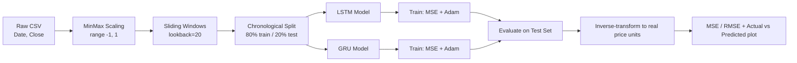

# Methodology

This document goes into more depth than the README on *why* the pipeline is
built the way it is, for readers who want to understand or extend the
modeling approach.

## 1. Problem Framing

We frame next-day stock price prediction as a **supervised regression**
problem over a **univariate time series**:

> Given the closing prices of the last `L` trading days (`L = lookback`),
> predict the closing price on day `L + 1`.

This is a simplification of real forecasting (no exogenous features, no
multi-step-ahead forecasting), chosen deliberately to keep the pipeline easy
to follow end-to-end while still exercising a real RNN training loop.

## 2. Pipeline Architecture



## 3. Why MinMax Scaling to `[-1, 1]`

RNNs (LSTM/GRU) use `tanh` and sigmoid activations internally, which are most
sensitive to inputs in the roughly `[-1, 1]` / `[0, 1]` range. Raw stock
prices (e.g., $20–$300) are far outside that range and would slow or
destabilize training. We fit the scaler **only on the data that will be
used**, and — critically — **inverse-transform predictions back to real
price units before computing MSE/RMSE**, so the reported metrics are in
dollars, not in scaled units.

> **Data leakage note:** In this reference implementation, the scaler is fit
> on the full series before the train/test split, which is simple to reason
> about but technically lets a small amount of test-set information (its
> min/max) influence the scaling. For research-grade rigor, fit the scaler
> on the training split only and apply the same transform to the test split.
> This is called out here explicitly rather than hidden, in the interest of
> transparency; see `CONTRIBUTING.md` if you'd like to submit that fix.

## 4. Why a Sliding Window (Lookback)

Sequence models need a fixed-length input. The sliding window approach turns
one long series of length `N` into `N - lookback` overlapping training
examples, each pairing `lookback` consecutive days with the day right after:

```
series:   [p0, p1, p2, p3, p4, p5, ...]
lookback=3:
  X[0] = [p0, p1, p2]   y[0] = p3
  X[1] = [p1, p2, p3]   y[1] = p4
  X[2] = [p2, p3, p4]   y[2] = p5
  ...
```

`lookback=20` (roughly one trading month) is a reasonable starting point;
see section 7 below for how changing it affects results.

## 5. Why LSTM and GRU Specifically

Both are gated RNN variants designed to mitigate the vanishing-gradient
problem that plain RNNs suffer from over long sequences:

- **LSTM** (Long Short-Term Memory) maintains a separate **cell state** and
  **hidden state**, controlled by input/forget/output gates. More
  expressive, more parameters.
- **GRU** (Gated Recurrent Unit) merges the cell and hidden state into one,
  using update/reset gates. Fewer parameters, often faster to train, and
  competitive accuracy on many tasks — which is exactly the comparison this
  project runs empirically rather than assuming.

Both are configured identically in this repo (same `hidden_dim`,
`num_layers`, epochs, learning rate) specifically so any accuracy or speed
difference observed is attributable to the architecture, not to unequal
tuning.

## 6. Evaluation Metrics

- **MSE** (Mean Squared Error): average squared difference between
  predicted and actual price. Penalizes large errors more heavily.
- **RMSE** (Root Mean Squared Error): `sqrt(MSE)`, expressed in the same
  units as price (dollars), which makes it more interpretable than MSE.

Both are computed **after inverse-transforming** predictions back to real
price units (see section 3), so a "Test RMSE: 0.77" means "off by about
$0.77 on average," not 0.77 scaled units.

## 7. Hyperparameters to Experiment With

| Hyperparameter | Where | Effect of increasing it |
|---|---|---|
| `lookback` | notebook Section 2 | More context per prediction, but fewer training sequences and slower training |
| `hidden_dim` | notebook Section 3 | More model capacity; risk of overfitting on a short series |
| `num_layers` | notebook Section 3 | Deeper temporal abstraction; harder to train, needs more data |
| `num_epochs` | notebook Section 4 | More fitting; watch the loss curve for a plateau or divergence |
| `learning_rate` | notebook Section 4 | Too high leads to unstable loss; too low leads to very slow convergence |

The notebook trains on the **full training set per epoch** (no
mini-batching), which is fine at this data scale but is a further place to
extend the project (see the README's "Possible Next Steps").

## 8. Why This Is *Not* a Trading Strategy

Low test RMSE on historical price windows does **not** imply the model can
be used to trade profitably:
- It doesn't account for transaction costs, slippage, or spread.
- Predicting "tomorrow is about equal to today, with small drift" is a
  low-effort baseline that can produce deceptively low RMSE on any
  random-walk-like series (including the synthetic GBM data shipped here)
  without any real predictive skill — always compare against a naive
  baseline (e.g., "predict tomorrow = today") before trusting a low RMSE.
- Markets incorporate information the model never sees (news, macro data,
  order flow).

See the README's "Limitations & Critical Thinking" section for further
reading recommendations.
